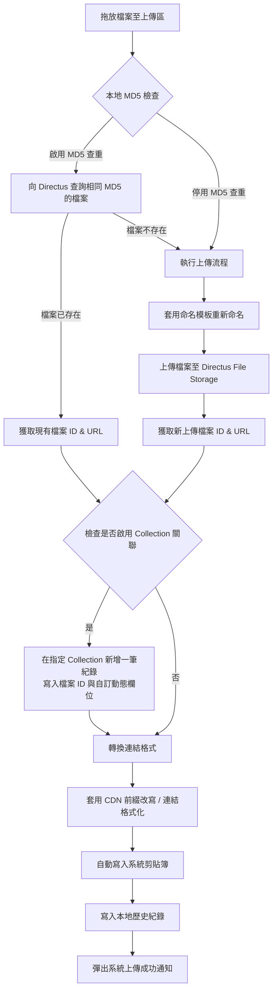

<p align="center">
  
</p>

<h1 align="center">DropTus</h1>

<p align="center">
  <strong>DropTus — 專為 Directus 打造的極致拖放上傳與關聯寫入利器</strong><br />
  基於 Tauri v2 + Vue 3 + Tailwind CSS v4 研發，專為高效創作者與開發者設計的輕量級桌面輔助軟體。
</p>

<p align="center">
  <a href="https://tauri.app/"></a>
  <a href="https://vuejs.org/"></a>
  <a href="https://tailwindcss.com/"></a>
  
  
</p>

---

## 📖 專案簡介

**DropTus** 是一款為 **Directus Headless CMS** 設計的第三方獨立檔案上傳輔助工具。提升高效生產力工作流，旨在幫助內容創作者、編輯以及開發人員，快速地將本機檔案或截圖直接拖放上傳至 Directus 伺服器，並在完成後自動生成自訂格式的連結（如 Raw URL、Markdown、HTML 等）寫入系統剪貼簿。

除此之外，DropTus 更內建了獨創的 **「雙步連動關聯」** 機制。在上傳檔案的同時，可自動於您指定的 Directus 資料表（Collection）中新增一筆資料並綁定該檔案 ID，甚至支援在拖放前輸入自訂的動態欄位。這使得 DropTus 不僅僅是一個簡單的圖床工具，更是一個能夠與您的 CMS 內容工作流無縫整合的生產力加速器。

> [!IMPORTANT]
> **🛡️ 隱私與安全聲明**
> DropTus **100% 尊重您的資料隱私**。您的 Directus 連線憑證（Email、Password、Static Tokens）、伺服器網址以及所有上傳模板，皆僅儲存在您本機的 `settings.json` 設定檔中。本專案沒有任何中轉雲端伺服器，所有的 API 請求皆由您的本機直接發送到您的 Directus 伺服器，安全、私密且快速。

---

## ⚙️ 核心特色與亮點

### 🔐 1. 多 Profile 伺服器管理
* **靈活切換**：支援配置多組不同的 Directus 伺服器、帳號或 Token，滿足開發、測試與生產環境的流暢切換。
* **憑證自動整理**：安全儲存憑證，並內建背景自動刷新憑證（Refresh Token）機制。
* **斷線容錯防刪**：若因伺服器重啟或網路瞬斷導致刷新失敗，僅會將連線標記為過期並提示重新登入，**絕對不會**擅自刪除您已儲存的 Profile 設定資訊。

### ⚙️ 2. 系統上傳模板 (Templates)
* **目錄同步**：與 Directus 目錄 API 自動同步，可指定檔案上傳的目標資料夾。
* **彈性重命名**：支援強大的檔名模板變數（如 `{y}-{m}-{d}-{filename}-{rand:4}` 或 `{uuid:8}`），從根本防範檔名衝突。
* **MD5 防重複上傳**：上傳前自動在本地計算檔案的 MD5 雜湊值並進行伺服器比對。若檔案已存在，則直接複用既有檔案，節省傳輸流量與伺服器空間。
* **S3 CDN 網址改寫**：若您的 Directus 後端配置了 S3 與 CDN 加速，可直接改寫生成的網址前綴，繞過 Directus 後端下載限制以加速載入。

### 🔗 3. 雙步 Collection 連動寫入
* **自動建立關聯**：上傳檔案後，自動在指定的 Collection 資料表中新增一筆數據（例如：文章封面、相簿紀錄），並將上傳的檔案 ID 寫入指定欄位（例如：`cover_image`）。
* **動態欄位輸入**：拖放檔案前，您可以直接在介面上輸入額外的欄位資料（如標題、分類或備註），系統會在上傳時一併寫入 Directus Collection。

### 📋 4. 剪貼簿連結複製
* **多格式支援**：提供 `Raw URL`、`Markdown`、`HTML` 以及 `自訂樣板`（例如 `{url}?width=800` 等參數擴充）。
* **一鍵背景傳送**：檔案拖放完成後即刻完成上傳，並在系統通知的同時將格式化連結寫入剪貼簿。
* **詳細歷史紀錄**：主視窗設有上傳歷史面板，支援縮圖預覽、一鍵複製單一連結，或批次一鍵複製（Copy All）所有選取連結。

### 📥 5. 常駐系統托盤 (System Tray)
* **極簡快速面板**：支援系統托盤常駐，滑鼠點擊托盤圖示即可彈出快速上傳面板，點擊其他地方失焦會自動收合。
* **釘選功能 (Always on Top)**：快速面板支援一鍵釘選，方便您在跨視窗拖放檔案時保持最上層顯示。

### 🎨 6. 精心雕琢的 macOS 原生體驗
* **Mac 交通號誌適配**：採用現代 macOS 應用程式常見的「側邊欄高度通天」排版。側邊欄頂部預留適當高度，避讓並與 macOS 左上角的三色控制按鈕完美調和。
* **自適應 RWD 排版**：當主視窗縮小至平板或手機尺寸時，側邊欄會自動切換為頂部橫向導覽列，並保留合理的安全邊距與排版寬度。
* **全域禁用文字選取**：為非輸入區塊配置全域 `user-select: none`，操作手感與原生 macOS App 無異，告別網頁般粗糙的滑鼠選取藍底。
* **新手指引手冊 (Help Modal)**：內建極簡、精緻的主視窗幫助彈窗，以無 Emoji 的專業 Lucide 圖標及步驟流程圖引導新手快速上手。

---

## 🗺️ 工作流程示意圖

以下為 DropTus 的檔案上傳與資料關聯處理工作流：



---

## 🚀 快速開始

### 📋 準備工作

確保您的開發環境已安裝以下組件：
* [Node.js](https://nodejs.org/) (建議 v18 以上版本)
* [pnpm](https://pnpm.io/) (專案優先推薦的套件管理工具)
* [Rust & Cargo](https://www.rust-lang.org/) (Tauri v2 編譯與底層 API 呼叫所需環境)

### 📦 安裝依賴

在專案根目錄下，使用 `pnpm` 進行依賴安裝：
```bash
pnpm install
```

### 💻 啟動開發模式

這會啟動前端 Vite 熱更新，並同步喚起 Tauri 桌面視窗：
```bash
pnpm tauri dev
```

### 🛠️ 建置正式發佈版本

編譯並打包出本地端的正式安裝套件（在 macOS 下會產生安裝引導 `.dmg` 或 `.app`；Windows 下會產生 `.msi`）：
```bash
pnpm tauri build
```

---

## 📂 專案目錄結構

```text
├── src/                      # 前端 Vue 3 專案原始碼
│   ├── assets/               # 靜態資源 (CSS 樣式與基本圖片)
│   ├── components/           # UI 元件與面板
│   │   ├── AuthManager.vue   # 伺服器 Profile 管理面板 (連線、登入、自動刷新 Token)
│   │   ├── HistoryList.vue   # 歷史紀錄清單 (預覽、單一複製、批次複製、刪除紀錄)
│   │   ├── SettingsPanel.vue # 系統模板設定表單 (路徑、檔名變數、CDN、關聯資料表)
│   │   ├── TrayPanel.vue     # 托盤快速上傳面板 (托盤定位、失焦關閉、極簡拖放)
│   │   └── UploadPanel.vue   # 主視窗上傳工作區 (拖放區域、互斥下拉選單、動態欄位)
│   ├── services/             # 邏輯服務與底層 API
│   │   ├── directus.ts       # Directus API 請求、登入、查重、Collection 關聯
│   │   ├── store.ts          # tauri-plugin-store 本地設定檔讀寫同步
│   │   └── uploader.ts       # 超連結格式化與剪貼簿操作
│   ├── App.vue               # 主視窗自適應排版、側邊欄、精簡 Header、Help Modal
│   ├── main.ts               # 前端進入點
│   └── style.css             # 全域樣式、低調 Scrollbar、禁用選取與滾動優化
│
├── src-tauri/                # Tauri Rust 後端原始碼
│   ├── src/
│   │   ├── tray.rs           # 系統托盤事件與 positioner 彈窗定位控制
│   │   └── lib.rs            # Tauri 插件註冊、視窗初始化與配置
│   ├── tauri.conf.json       # Tauri 視窗與打包權限設定
│   └── Cargo.toml            # Rust 依賴配置
│
├── public/                   # 靜態公共資源
│   └── logo.png              # 應用程式 Logo
│
└── package.json              # 專案依賴與腳本定義 (目前版本 v0.1.0)
```

---

## 🛡️ 免責與隱私聲明

1. **資料隱私**：DropTus 的所有配置資訊、連線密鑰與歷史紀錄均儲存於您的本機電腦。本軟體不包含任何第三方數據收集、上傳或追蹤代碼。
2. **非官方工具**：本專案為第三方獨立開源工具，並非由 Directus 官方團隊提供或維護。
3. **免責聲明**：使用者需自行承擔使用本軟體時可能產生的伺服器流量、檔案遺失或資料表寫入異常之風險。建議在使用 Collection 關聯寫入前，先於 Directus 測試環境進行測試。

---

## 📄 開源許可

本專案採用 [MIT License](LICENSE) 授權許可協定。歡迎提交 Issue 或 Pull Request 共同完善體驗！
